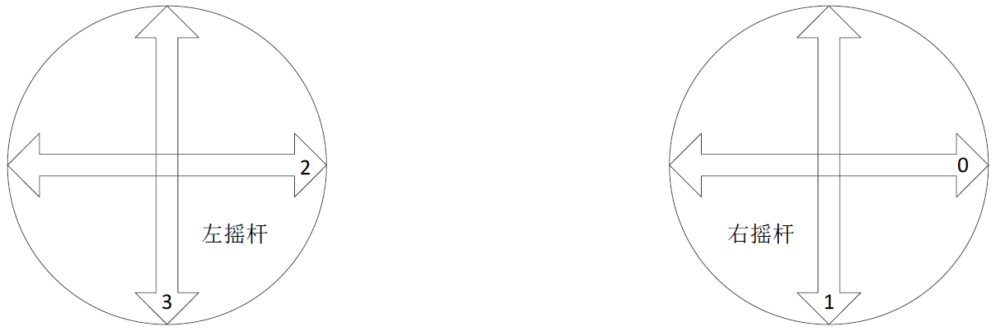
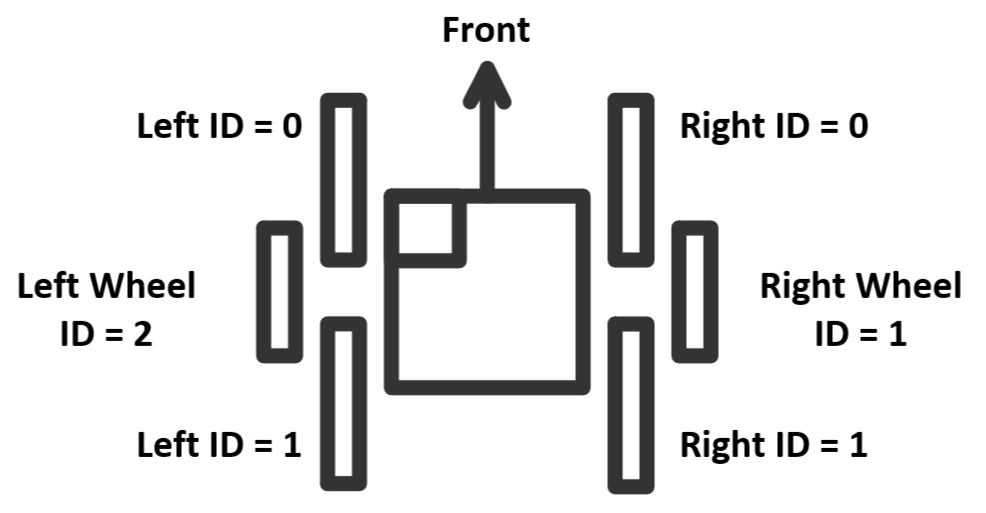

## 测试日志
- 2024.4.7
  - makefile heap_4 的文件夹路径打错了
  - makefile 加了core\Src\tim.c，根本没Core这个文件
- 2024.4.8
  - 不同的C板有差异
  - 自己的C板YAW初始位置=南偏东50°
  - 实验室C板YAW初始位置=正南
  - 说明DJI带指南针解算
- 2024.4.11
  - 开始反向移植控制程序
  - [x] 移植 Motor_MI
  - [ ] 移植 Motor_A1
  - [x] 移植 遥控器
  - Debug: USART3 Baud Rate 多打了个0 麻了

## 文档说明

$\Updownarrow$ = CH[3]  
$\Leftrightarrow$ = CH[2]

  

  

